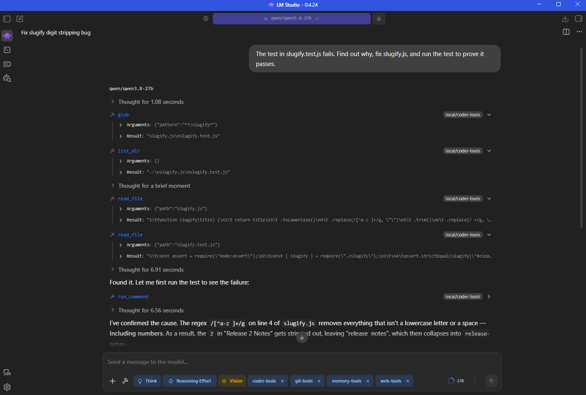

<h1 align="center">LM Studio Agent Toolkit</h1>

<p align="center">
  <b>Turn a local model in <a href="https://lmstudio.ai">LM Studio</a> into a working coding agent.</b><br>
  Files and a shell, memory that survives between chats, Git and GitHub, the web with a real browser, and documents.<br>
  No API keys, no cloud, nothing leaves your machine.
</p>

<p align="center">
  <a href="https://github.com/cervezagua/lmstudio-agent-toolkit/actions/workflows/ci.yml"></a>
  <a href="LICENSE"></a>
  
  
</p>

---

## What it looks like

<p align="center">
  
</p>

<p align="center"><sub>A real session in LM Studio. The model goes on to fix the regex and re-run the test to <code>exit_code: 0</code>.</sub></p>

Every one of those calls is shown to you for approval before it runs.

## One plugin, five groups

Install one plugin, point it at a folder, and switch on what you need. Each group is a checkbox in the plugin's settings, because a long tool list makes small models choose worse.

| Group | Default | What the model can do | Highlights |
|---|---|---|---|
| **Files & Shell** | on | Read, write and edit files, search, run commands | Locked to your project folder · read-before-edit protection · background tasks · project diagnostics · optional research sub-agent |
| **Memory & Context** | on | Remember things between chats, keep a todo list, follow skills | Loads your `AGENTS.md` + today's date + git status into each new chat · plan mode that really withholds tools |
| **Git & GitHub** | on | Status, diff, commit, branch, and GitHub PRs and issues | Runs `git`/`gh` directly, never through a shell · push is opt-in and never forced |
| **Web** | off | Search, read pages as markdown, drive a real browser | Private SearXNG search · PDF reading · pages cached · Edge/Chrome via Playwright |
| **Documents** | off | Read PDFs, scans and images from disk | Text layer first (free and exact) · OCR only when needed · **your chat model does not need vision** |

Full tool and settings reference: [plugin/README.md](plugin/README.md).

> [!TIP]
> **Skills you already wrote work here.** The toolkit reads the standard Agent Skills layout — `<skill>/SKILL.md` with `name:` and `description:` frontmatter — so pointing **Skills Directory** at `~/.claude/skills` hands your local model the same skills you use with Claude Code, Codex or LM Studio Bionic.

## Quickstart

> [!NOTE]
> Needs **LM Studio** (with its `lms` CLI). Optional: [GitHub CLI](https://cli.github.com) for the `gh_*` tools, [ripgrep](https://github.com/BurntSushi/ripgrep) for faster search, Edge or Chrome for the browser tools.

**From LM Studio Hub:**

```bash
lms get cervezagua/agent-toolkit
```

**From source** — for hacking on it (needs Node.js 22+ and git):

```bash
git clone https://github.com/cervezagua/lmstudio-agent-toolkit.git
cd lmstudio-agent-toolkit
npm run setup
```

Either way LM Studio fetches the dependencies itself. Re-run `npm run setup` after `git pull` to update.

Then, in LM Studio:

1. **Load a tool-capable model** (LM Studio marks these "Tool use"). Give it at least ~32k context: file contents and command output fill a window fast.
2. **Enable agent-toolkit** in the chat — it appears as a chip under the message box.
3. **Click the chip and set Project Folder** to the folder you want the model to work in. Every group uses it.
4. **Switch on the groups you want.** Web and Documents start off.
5. **Keep tool call confirmation on**, and approve calls as they come.
6. **Ask for work**: *"explain this project"*, *"fix the failing test"*, *"what changed since last week?"*

Verified end to end with `qwen/qwen3.8-27b`: editing files, running commands, git, browsing, and transcribing a scanned page.

> [!IMPORTANT]
> **Upgrading from the five separate plugins?** Remove `coder-tools`, `memory-tools`, `git-tools`, `web-tools` and `ocr-tools` from your chats, install `agent-toolkit`, and set **Project Folder** once. The old per-chat settings don't carry over, since this is a new plugin.

## Safety

> [!WARNING]
> This plugin lets a model act on your computer. Approving a tool call is the same as running that command yourself.

| Guard | What it does |
|---|---|
| **Project Folder** | File tools resolve every path inside your project folder, after following symlinks and junctions. (`read_file` may also open the plugin's own output files in the chat folder.) |
| **Read before edit** | A file must be read in this chat before it can be edited, and the edit is refused if the file changed since. The model can't overwrite what it never saw. |
| **Atomic writes** | Files are written to a temp file and renamed, so an interrupted write can't truncate your work. |
| **Blocked commands** | Refuses catastrophic ones (`rm -rf /`, `format C:`, `diskpart`…). A seatbelt, not a sandbox: a shell command can still do anything your account can. |
| **Opt-in danger** | `git_push` is off by default and never force-pushes; the shell can be turned off entirely. |
| **Plan mode** | While planning, every tool that changes a file disappears from the model's tool list until it presents a plan. `run_command` stays, so the model can still inspect things, with a reminder that planning is on. |

Details and how to report a problem: [SECURITY.md](SECURITY.md).

## Why it behaves well with small models

<details>
<summary><b>Design decisions that matter in practice</b> (click to expand)</summary>

- **Mistakes come back as text, not failures.** A bad path, ambiguous edit or git error returns `Error: …` so the model can correct itself instead of the chat dying.
- **Edits are exact replacements** that must match once, so a model never rewrites a whole file to change one line. LF text matches CRLF files, and any edit can be previewed as a diff or undone.
- **Nothing is silently lost.** Long command output is written whole to a file and its path returned; long documents and search results page with `offset`.
- **Cheap answers first.** `grep` can return only file names or counts, `read_document_text` reads a PDF's text layer without a model, and fetched pages are cached for a few minutes.
- **The model starts informed.** Each chat opens with today's date, your `AGENTS.md`, the memory index, and — in a git repo — the branch, uncommitted changes and recent commits.
- **Real exit codes.** PowerShell's `-Command` collapses every failure to `1`; `run_command` reports what actually happened.
- **No shell in the middle of git.** git tools run `git` and `gh` directly, reject refs that look like options, and never open an editor or credential prompt.
- **The browser is navigable by number.** A snapshot lists `[3] link "Docs" -> /docs`, and the model clicks or types by that number.

</details>

## Web search

The Web group uses [SearXNG](https://github.com/searxng/searxng) at `http://localhost:8888` when it's running and falls back to DuckDuckGo otherwise — though DuckDuckGo often answers automated requests with a bot check, which the tool reports rather than works around. [`searxng/`](searxng/README.md) sets up a private instance in WSL on Windows; any SearXNG with the JSON format enabled works. A Brave Search API key is the third option.

## Limitations

- LM Studio plugins can't rewrite earlier chat history, so there's no automatic context compaction. When a chat gets long, have the model call `save_session_summary` and continue in a new one.
- A plugin can't add its own button to the chat, so the project folder is a field in the plugin's settings rather than a folder picker.
- All chats share one browser instance.
- Results depend on the model. Bigger tool-use models plan multi-step work far better than small ones.

## Contributing

Issues and pull requests welcome — [CONTRIBUTING.md](CONTRIBUTING.md) covers the layout, the tests and how to add a tool. Tests run on Windows and Linux in CI.

## License

[MIT](LICENSE)
