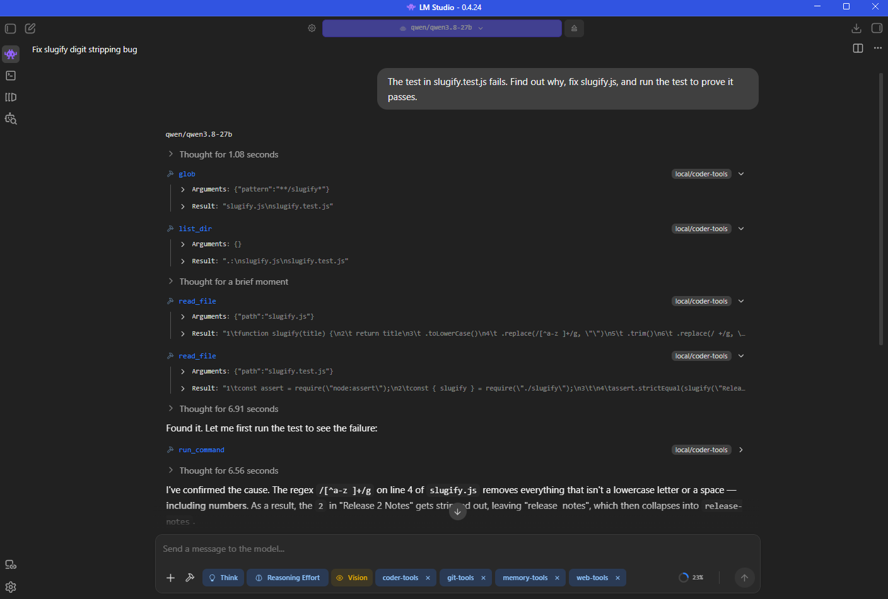

<h1 align="center">🧰 LM Studio Agent Toolkit</h1>

<p align="center">
  <b>Turn a local model in <a href="https://lmstudio.ai">LM Studio</a> into a working coding agent.</b><br>
  It reads and edits your code, runs your tests, remembers your project, uses git, searches the web and reads your documents.<br>
  <b>No API keys. No cloud. Nothing leaves your machine.</b>
</p>

<p align="center">
  <a href="https://github.com/cervezagua/lmstudio-agent-toolkit/actions/workflows/ci.yml"></a>
  <a href="LICENSE"></a>
  
  
  <a href="https://lmstudio.ai/cervezagua/agent-toolkit"></a>
</p>

<p align="center">
  <a href="#-quickstart">Quickstart</a> ·
  <a href="#-what-your-model-can-do">What it can do</a> ·
  <a href="#-tips--tricks">Tips &amp; tricks</a> ·
  <a href="#-safety">Safety</a> ·
  <a href="plugin/README.md">Full reference</a>
</p>

---

<p align="center">
  
</p>

<p align="center"><sub>A real session in LM Studio. The model goes on to fix the regex and re-run the test to <code>exit_code: 0</code>. Every call was shown for approval before it ran.</sub></p>

## ⚡ Quickstart

```bash
lms get cervezagua/agent-toolkit
```

Then, in LM Studio:

1. **Load a tool-capable model** — LM Studio marks these "Tool use". Give it **32k context or more**.
2. **Enable `agent-toolkit`** — it appears as a chip under the message box.
3. **Click the chip and set Project Folder** to the folder you want the model to work in.
4. **Ask for work**: *"explain this project"*, *"fix the failing test"*, *"what changed since last week?"*

That's it. Keep LM Studio's tool call confirmation on, and approve calls as they come.

<details>
<summary><b>Install from source instead</b> (for hacking on it)</summary>

Needs Node.js 22+ and git.

```bash
git clone https://github.com/cervezagua/lmstudio-agent-toolkit.git
cd lmstudio-agent-toolkit
npm run setup
```

LM Studio fetches the dependencies itself. Re-run `npm run setup` after `git pull` to update.

</details>

> [!IMPORTANT]
> **Upgrading from the five separate plugins?** Remove `coder-tools`, `memory-tools`, `git-tools`, `web-tools` and `ocr-tools` from your chats — enabling them next to `agent-toolkit` gives the model two copies of every tool. Then set **Project Folder** once, and if you used `web-tools` or `ocr-tools`, switch on **Web** or **Documents**: they start off.

## 🧩 What your model can do

One plugin, five groups. Each group is a switch in the plugin's settings, because a long tool list makes small models choose worse.

| | Group | Default | What the model can do | Highlights |
|---|---|:---:|---|---|
| 📁 | **Files & Shell** | on | Read, write and edit files, search, run commands | Locked to your project folder · read-before-edit · undo · background tasks · project diagnostics |
| 🧠 | **Memory & Context** | on | Remember things between chats, keep a todo list, follow skills | Opens each chat with your `AGENTS.md`, today's date and git status · plan mode · can save its own skills and search past chats, if you switch those on |
| 🌿 | **Git & GitHub** | on | Status, diff, commit, branch, pull requests and issues | Runs `git`/`gh` directly, never through a shell · push is opt-in, never forced |
| 🌐 | **Web** | off | Search, read pages as markdown, drive a real browser, read feeds and video transcripts | Private SearXNG search · read just part of a page · reads PDFs · RSS/Atom · YouTube transcripts via yt-dlp · Edge or Chrome via Playwright |
| 📄 | **Documents** | off | Read PDFs, scans and images from your folder | Text layer first, free and exact · OCR only when needed · **your chat model needs no vision** |

Every tool and setting is in the [full reference](plugin/README.md).

### Just one tool?

Two of the Web tools also come as small plugins of their own (install from a clone of this repo for now; Hub listings to follow):

| Plugin | What it adds | Install |
|---|---|---|
| [**feed-reader**](standalone/feed-reader/README.md) | `read_feed`: the latest items of any RSS or Atom feed | `npm run setup -- feed-reader` |
| [**video-transcripts**](standalone/video-transcripts/README.md) | `video_transcript`: what's said in a YouTube or other video (needs [yt-dlp](https://github.com/yt-dlp/yt-dlp)) | `npm run setup -- video-transcripts` |

They're the same code as agent-toolkit's, so don't enable one alongside agent-toolkit with Web on, or the model sees the tool twice.

## 💡 Tips & tricks

### Get better results

- **Write an `AGENTS.md`** in your project: how to run the tests, which folders matter, what not to touch. It's loaded into every new chat automatically, so you stop repeating yourself. `CLAUDE.md` works too.
- **Ask for plan mode on anything big.** *"Enter plan mode and plan how you'd add X"*: while planning, the file-changing tools disappear until the model presents its plan with `exit_plan_mode`.
- **Point at the file when you know it.** *"The bug is in `src/parse.ts`"* saves a model several searches and a lot of context.
- **Tell it to prove its work.** *"…and run the tests to show it passes"* turns a guess into a checked result.
- **Read only the part of a page you need.** *"Fetch the pricing page, just the table"* lets the model pass a CSS selector to `fetch_url` instead of reading the whole page into its context.
- **Summarise a video instead of watching it.** With yt-dlp installed: *"What does this talk say about caching? <YouTube link>"*.
- **Follow a blog or a project's releases.** *"What's new on https://example.com/blog?"* reads its feed, even from the home page.
- **Ask for file names before contents.** A model can `grep` for just the files that match, or just the counts, which costs a fraction of the context of full results.
- **Made a mistake? Ask for `undo_edit`.** It restores a file to how it was before the chat's last change to it.
- **Start dev servers in the background.** *"Start the dev server in the background and check it came up"* uses the task tools, so the chat isn't stuck waiting on a process that never exits.

### Long chats

- **When a chat gets long, have the model call `save_session_summary`**, then start a new chat. The summary is saved as a memory, and the next chat sees it in its memory index. LM Studio plugins can't shorten the history of a running chat.
- **Tell it what to remember.** *"Remember that we deploy from the `release` branch"* saves a memory, which every future chat sees in its memory index and can read in full.
- **Let it search your earlier chats.** Switch on **Search Past Chats** and ask *"what was the command we used to deploy last week?"*. It's off by default, because those chats hold everything you've typed in LM Studio.
- **Turn a solved problem into a skill.** Switch on **Let the Model Save Skills**, and after a task say *"save what you just did as a skill"*. You see the whole skill before it's written, and future chats can load it.

### Choose and tune the model

- **Bigger tool-use models plan multi-step work far better** than small ones. Checked end to end with `qwen/qwen3.8-27b`.
- **Switch off the groups you don't need.** Fewer tools means better choices, especially on small models.
- **Models with their safety training stripped out** ("uncensored", "abliterated") are often worse at following tool formats and may drift between languages. If one starts answering in the wrong language, add *"Always reply in English."* to the chat's system prompt.
- **Pick the models for OCR and the research sub-agent from a dropdown** in the Documents and Files settings. It lists the models you have; after downloading a new one, turn the plugin off and on to refresh the list.

### Make the tools faster

- **Install [ripgrep](https://github.com/BurntSushi/ripgrep)** and searches get much faster. Results are identical either way.
- **Install the [GitHub CLI](https://cli.github.com)** and run `gh auth login`, and the pull request and issue tools appear.
- **Run [SearXNG](searxng/README.md) for web search.** Without it, search falls back to DuckDuckGo, which often answers automated requests with a bot check. [`searxng/`](searxng/README.md) sets one up in WSL on Windows; on macOS or Linux, any SearXNG with the JSON format enabled works.
- **Reuse your skills.** Skills are the standard `<skill>/SKILL.md` layout, so pointing **Skills Directory** at `~/.lmstudio/skills` (LM Studio Bionic's folder) or `~/.claude/skills` gives your local model the skills you already have.

### When something looks wrong

| You see | What's going on | Fix |
|---|---|---|
| The model keeps calling the wrong tool, insisting another one is "available" | It remembers a tool from earlier in the chat that isn't switched on now — often `web_search`, since **Web starts off** | Switch the group on in the plugin's settings, or start a new chat |
| The model says your project is empty | No Project Folder is set, so it's in the chat's own empty scratch folder. The model is told this, but small ones may miss it | Set **Project Folder** |
| *"Read the file first"* on a file the model already read | Changing settings restarts the plugin, which forgets what was read. It's a safety check, not an error | Let the model read it again |
| *"is not a git repository"* | Project Folder isn't a git repo, or isn't set | Point Project Folder at the repo, or ask for `git_init` |
| *"SearXNG unavailable, used DuckDuckGo"* | Your SearXNG isn't running | Start it (`searxng/start-searxng.cmd` on Windows) |
| A web tool fails, or `video_transcript` is missing | Something the Web group needs isn't set up | Ask the model to run `web_doctor`: it checks SearXNG, the browser and yt-dlp, and says how to fix each |
| *"agent-toolkit did not load AGENTS.md…"* | The file contains a line that looks written to steer the model, such as "ignore previous instructions" | Read the quoted line. Fix the file, or switch off **Scan Loaded Files** if it's a false alarm |
| A model you just downloaded is missing from a dropdown | The list is read when the plugin starts | Turn the plugin off and on |

### Platform notes

- **Windows:** commands run in PowerShell, with real exit codes. The toolkit repairs a missing `PATHEXT` in LM Studio's plugin host, so `node`, `python` and `git` resolve as they do in your terminal.
- **macOS:** apps started from the Dock don't see Homebrew's folders, so the toolkit adds `/opt/homebrew/bin` and `/usr/local/bin` back itself. The browser defaults to Chrome.
- **Linux:** works out of the box; the browser defaults to Chrome.

## 🛡️ Safety

> [!WARNING]
> This plugin lets a model act on your computer. Approving a tool call is the same as running that command yourself.

| Guard | What it does |
|---|---|
| **Project Folder** | File tools resolve every path inside your project folder, after following symlinks and junctions, so a link can't lead out of it. |
| **Read before edit** | A file must be read in this chat before it can be edited, and the edit is refused if the file changed since. The model can't overwrite what it never saw. |
| **Atomic writes** | Files are written to a temporary file and renamed, so an interrupted write can't truncate your work. |
| **Blocked commands** | Catastrophic ones (`rm -rf /`, `format C:`, `diskpart`…) are refused. A seatbelt, not a sandbox: a shell command can still do anything your account can. |
| **Opt-in danger** | `git_push` is off by default and never force-pushes; the shell can be switched off entirely. |
| **Plan mode** | While planning, every tool that changes a file is withheld until the model presents a plan. `run_command` stays, so it can still look around, with a reminder that planning is on. |
| **Scan loaded files** | An `AGENTS.md` or skill that tells the model to ignore its instructions, hides text in invisible characters, or sends your keys somewhere is not loaded. You're shown the line that tripped it. Simple pattern checks: they catch blunt attempts, not subtle ones. |

For untrusted projects, switch off **Allow Shell Commands** or run LM Studio in a virtual machine. More in [SECURITY.md](SECURITY.md).

## ⚙️ Why it behaves well with small models

<details>
<summary><b>Design decisions that matter in practice</b> (click to expand)</summary>

- **Mistakes come back as text, not failures.** A bad path, ambiguous edit or git error returns `Error: …`, so the model can correct itself instead of the chat dying.
- **Edits are exact replacements** that must match once, so a model never rewrites a whole file to change one line. LF text matches CRLF files, and any edit can be previewed as a diff or undone.
- **Nothing is silently lost.** Long command output is written whole to a file and its path returned; long documents and search results page with `offset`.
- **Cheap answers first.** `grep` can return just file names or counts, `read_document_text` reads a PDF's text layer without a model, and fetched pages are cached for a few minutes.
- **The same answers on every machine.** `grep` returns identical lines with or without ripgrep.
- **Skills are read whole.** A description that wraps, is quoted across lines, or uses YAML's `>` or `|` blocks keeps the part that says when to use the skill.
- **The model starts informed.** Each chat opens with today's date, your `AGENTS.md`, the memory index and, in a git repo, the branch, uncommitted changes and recent commits.
- **It knows when it's in the wrong place.** Without a Project Folder the model is told it's in an empty scratch folder, instead of concluding your project is empty.
- **Real exit codes.** PowerShell's `-Command` collapses every failure to `1`; `run_command` reports what actually happened.
- **No shell in the middle of git.** git tools run `git` and `gh` directly, reject refs that look like options, and never open an editor or a credential prompt.
- **The browser is navigable by number.** A snapshot lists `[3] link "Docs" -> /docs`, and the model clicks or types by that number.

</details>

## 🚧 Limitations

- LM Studio plugins can't rewrite earlier chat history, so there's no automatic context compaction. Use `save_session_summary` and a new chat.
- A plugin can't add its own button to the chat, so the project folder is set in the plugin's settings rather than with a folder picker.
- All chats share one browser.
- Results depend on the model.

## 🤝 Contributing

Issues and pull requests are welcome. [CONTRIBUTING.md](CONTRIBUTING.md) covers the layout, the tests and how to add a tool. CI runs the tests on Windows, macOS and Linux.

## 📜 License

[MIT](LICENSE)
